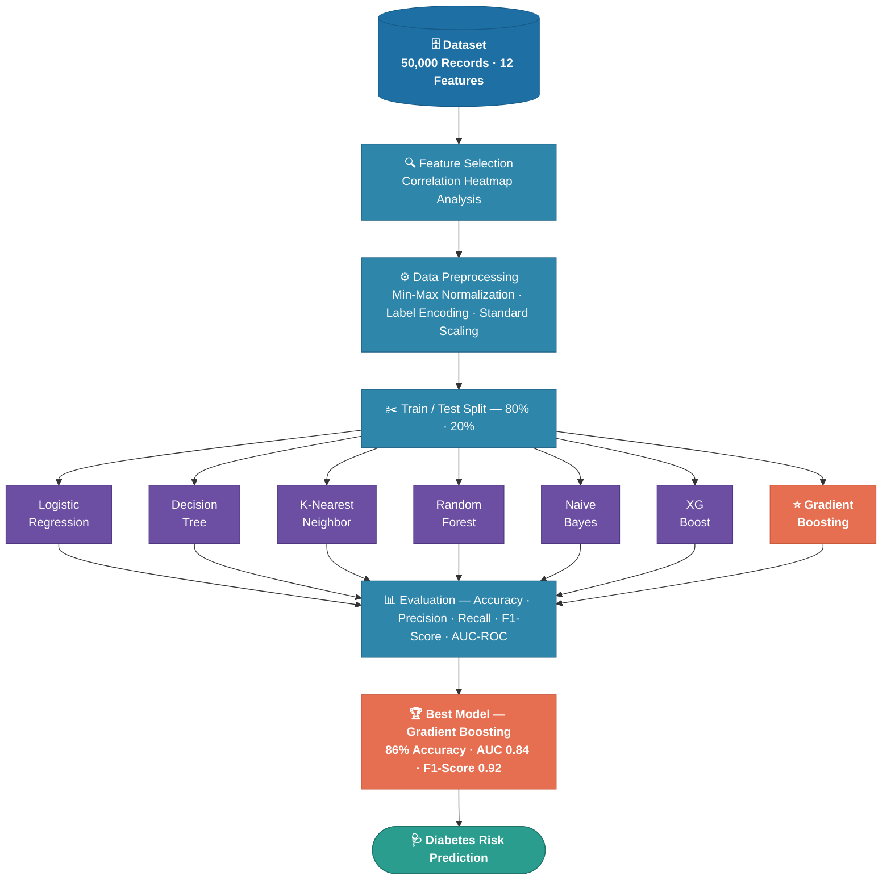

# 🩺 Diabetes Detection and Prediction System


> 🏆 A machine learning system for early diabetes detection — **a research paper on this project was written and published in IEEE Xplore (2025).**

---

## 📄 IEEE Publication

> **"Diabetes Detection and Prediction Using the Machine Learning Paradigm"**  
> 👥 Saksham Gupta, Aarush Wali, Gandharv Kaloo, **Archit Bali**, Palvi Sharma  
> 🏫 Model Institute of Engineering & Technology, Jammu, India  
> 📰 **Published in IEEE Xplore, 2025**  
> 🔗 [Read the Paper →](https://ieeexplore.ieee.org/document/11011335)

---

## 📌 Overview

Diabetes mellitus affects over **537 million adults** worldwide. Early detection is critical to preventing life-threatening complications like cardiovascular disease, kidney failure, and nerve damage.

This project benchmarks **7 supervised ML algorithms** on a dataset of **50,000 patient records**, incorporating both traditional health indicators and **gender-specific factors** (hormonal influences, BMI thresholds, gestational history) to build a robust, inclusive prediction system.

---

## 🔄 Methodology Flowchart



---

## 🗂️ Dataset

| Property | Details |
|---|---|
| 📦 Source | Kaggle (merged & processed) |
| 📏 Size | 50,000 entries · 12 attributes |
| ✂️ Split | 80% Train (40,000) / 20% Test (10,000) |

**Features used:**

| Feature | Description |
|---|---|
| 👤 Gender | Male / Female (encoded: 1 / 0) |
| 🎂 Age | Patient age in years |
| 💉 HbA1c Level | Glycated haemoglobin level |
| 🩸 Blood Glucose Level | Fasting blood glucose |
| ⚖️ BMI | Body Mass Index |
| ❤️ Heart Disease | Presence of heart disease |
| 🫀 Hypertension | Presence of hypertension |
| 🚬 Smoking History | Categorical smoking status |
| 🤰 Pregnancies | Number of pregnancies |
| 🧬 Genetics | Genetic predisposition flag |
| 🧪 Cholesterol | Cholesterol level |
| 💊 Blood Pressure | Diastolic blood pressure |

---

## 🛠️ Tech Stack


---

## 🤖 Model Results

| Algorithm | Accuracy | Precision | Recall | F1-Score |
|---|---|---|---|---|
| Logistic Regression | 0.81 | 0.84 | 0.94 | 0.89 |
| Decision Tree | 0.78 | 0.87 | 0.85 | 0.86 |
| K-Nearest Neighbor | 0.82 | 0.84 | 0.96 | 0.89 |
| Random Forest | 0.85 | 0.85 | 0.99 | 0.92 |
| Naive Bayes | 0.80 | 0.85 | 0.91 | 0.88 |
| XGBoost | 0.85 | 0.86 | 0.98 | 0.91 |
| 🏆 **Gradient Boosting** | **0.86** | **0.85** | **0.98** | **0.92** |

### 🏆 Best Model — Gradient Boosting
- ✅ **86% accuracy** · AUC = **0.84**
- ✅ Correctly classified **8,013 non-diabetic** and **566 diabetic** cases
- ✅ Strong generalization — minimal overfitting on test data

---

## 🔑 Key Findings

- 🥇 **Gradient Boosting & XGBoost** outperformed all models via ensemble learning + regularization
- 👥 **Gender-specific factors** (BMI thresholds, hormonal variations, gestational history) improved reliability
- 🩸 **Blood glucose (0.26)**, **cholesterol (0.32)**, and **HbA1c (0.26)** were the strongest predictors
- 🔗 **Gender & pregnancy** showed strong negative correlation (-0.85), validating gender-aware modeling

---

## ▶️ Getting Started

```bash
# 1. Clone the repository
git clone https://github.com/architinit/Diabetes-Detection-and-Prediction-System-.git
cd Diabetes-Detection-and-Prediction-System-

# 2. Install dependencies
pip install pandas numpy scikit-learn matplotlib seaborn xgboost jupyter

# 3. Run the notebook
jupyter notebook Main.ipynb
```

---

## 👤 Author

**Archit Bali**  
B.Tech CSE (AI/ML) · Model Institute of Engineering & Technology, Jammu

[](https://github.com/architinit)
[](https://linkedin.com/in/archit-bali)
[](mailto:archit.init@gmail.com)

---

## 📜 Citation

```bibtex
@inproceedings{gupta2025diabetes,
  title     = {Diabetes Detection and Prediction Using the Machine Learning Paradigm},
  author    = {Gupta, Saksham and Wali, Aarush and Kaloo, Gandharv and Bali, Archit and Sharma, Palvi},
  booktitle = {IEEE Xplore},
  year      = {2025},
  url       = {https://ieeexplore.ieee.org/document/11011335}
}
```

---

<p align="center">⭐ Star this repo if you found it useful!</p>
